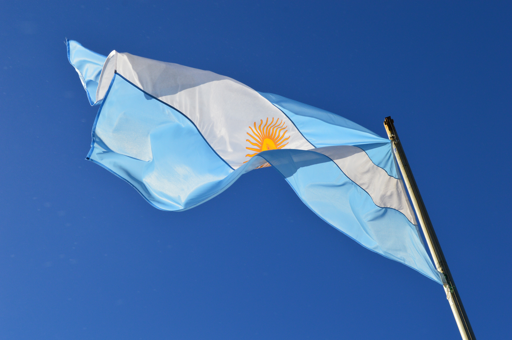
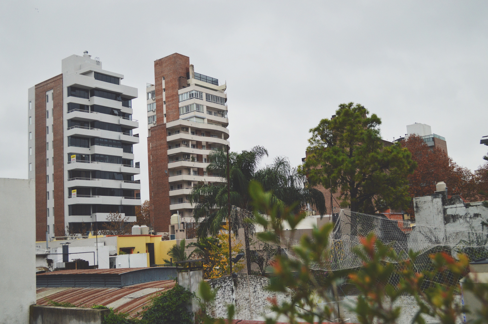
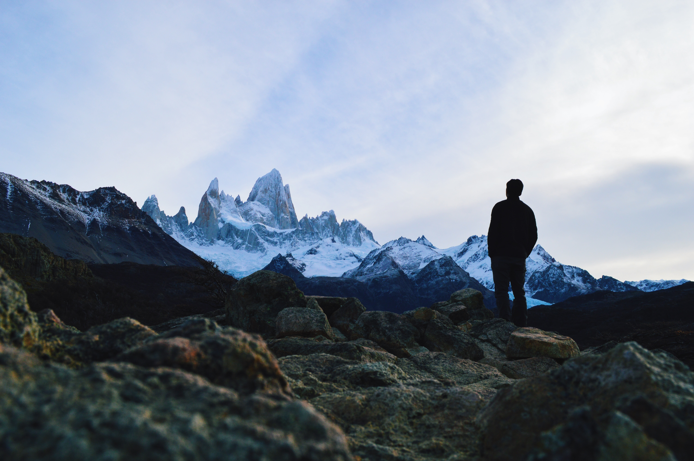

The Argentine flag in Iguazú.

On April 27th, 2016, I bought a plane ticket to Argentina. The culmination of a year long effort had finally crystallized. It was real. I was going to spend 7 weeks in a country I could've never dreamed of visiting. I was bursting with mixtures of excitement and anxiety. I constantly found myself asking: "What is it going to be like?" Little did I know that my journey was about to begin with quite a twist.

Check it out live [here.](http://effulgence.io/12)

After a 26-hour delay, I luckily got on a flight as a standby passenger and arrived in Buenos Aires 10 hours later. On arrival, it slowly dawned upon me that there was something amiss. My baggage had been mishandled and was still stuck in Texas. This was problematic, as my trip was already off to a bad start with the weather-induced flight delay. I promptly walked up to the baggage claim and expressed my concern in Spanish, and immediately realized that I did not understand a single word that was spoken back to me. The accent was so thick, words blended together so seamlessly, it was like a cacaophony of barely recognizable Spanish words laden with a heavy Italian accent. I had to ask to speak to someone in English and they promptly filed my claim. I hung around the airport waiting for my 5-hour bus ride to Rosario (about 200km away). During this time, I also got to experience my first meal in Argentina: McDonalds. And so began the long ride to Rosario.

I arrived late at night in Rosario with my phone dead and an address of my host family's home. The bus driver assisted me in finding the exact door and made sure that I arrived at my destination safely and that someone was home. I met my host mother and we clicked right away. She served me some warm dinner (pastel del carne) with a refreshing glass of wine while we conversed about the whole fiasco I had just experienced. My host mother and I developed an incredibly strong bond, and every single night of dinner consisted of lively conversations spanning a variety of topics ranging from adversity, love, tragedy, politics, history, consciousness, spirituality, and meditation amongst other things.

The majestic Cerro Fitz Roy. Hover your mouse over it!

<figure>
	<blockquote>
		
It is a press, certainly, but a press from which shall flow in inexhaustible streams… Through it, god will spread his word.

		<footer>
			<cite>—Johannes Gutenberg</cite>
		</footer>
	</blockquote>
</figure>
